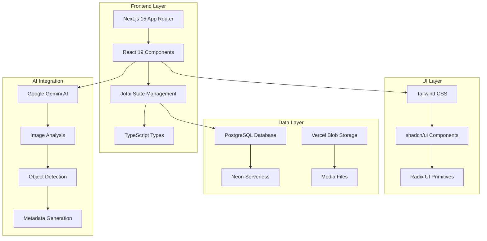

# The Itemizer - AI-Powered Inventory Management System


*An intelligent household inventory management system that transforms how you catalog, organize, and manage your belongings using cutting-edge AI technology.*

[](https://vercel.com/joshogden360s-projects/v0-apartment-inventory-schema)
[](https://v0.dev/chat/projects/WtKs32KUcBF)
[](https://typescriptlang.org/)
[](https://reactjs.org/)
[](https://nextjs.org/)
[](https://jotai.org/)

## 🚀 Overview

The Itemizer revolutionizes household inventory management by combining artificial intelligence with intuitive user experience. Snap a photo, let AI identify your items, and build a comprehensive digital inventory with minimal effort.

### ✨ Key Features

- 🤖 **AI-Powered Detection**: Automatically identify and catalog items from photos using Google Gemini AI
- 📸 **Smart Image Processing**: Upload photos or capture directly with camera support
- 🎯 **Interactive Selection**: Multiple selection modes (single, multi, crop) for precise item identification
- 📦 **Comprehensive Inventory**: Rich item details with metadata, categories, and custom tags
- 🏠 **Room Organization**: Organize items by rooms and locations
- 🔧 **Maintenance Tracking**: Schedule and track maintenance for your belongings
- 📄 **Document Management**: Attach warranties, manuals, and receipts
- 🌙 **Modern UI**: Beautiful, responsive interface with dark/light theme support
- 💾 **Smart State Management**: Powered by Jotai atoms for optimal performance

## 🏗️ Architecture



## 🛠️ Technology Stack

### Frontend
- **Framework**: Next.js 15.2.4 with App Router
- **UI Library**: React 19
- **State Management**: Jotai (atomic state management)
- **Styling**: Tailwind CSS + shadcn/ui components
- **Type Safety**: TypeScript 5+
- **Form Handling**: React Hook Form with Zod validation

### Backend & Database
- **Database**: PostgreSQL via Neon Serverless
- **File Storage**: Vercel Blob Storage
- **Authentication**: Vercel OAuth (extensible)
- **API**: Next.js Server Actions

### AI & Processing
- **AI Model**: Google Gemini 1.5 Flash
- **Image Processing**: Client-side canvas manipulation
- **Object Detection**: Bounding box identification
- **Metadata Generation**: AI-powered item descriptions

## 🚦 Getting Started

### Prerequisites
- Node.js 18+ 
- npm or pnpm
- PostgreSQL database (Neon recommended)
- Google AI API key

### Installation

1. **Clone the repository**
   ```bash
   git clone https://github.com/your-username/itemizer.git
   cd itemizer
   ```

2. **Install dependencies**
   ```bash
   npm install
   # or
   pnpm install
   ```

3. **Environment Setup**
   ```bash
   cp .env.example .env.local
   ```
   
   Add your environment variables:
   ```env
   DATABASE_URL=your_neon_database_url
   GOOGLE_AI_API_KEY=your_gemini_api_key
   BLOB_READ_WRITE_TOKEN=your_vercel_blob_token
   NEXT_PUBLIC_VERCEL_OAUTH_URL=your_oauth_url
   ```

4. **Database Setup**
   ```bash
   # Run database migrations (if available)
   npm run db:migrate
   ```

5. **Start Development Server**
   ```bash
   npm run dev
   ```

6. **Open your browser**
   Navigate to `http://localhost:3000`

## 📱 Usage

### Basic Workflow

1. **Capture/Upload Image**: Take a photo or upload an existing image
2. **AI Detection**: Click "Find Items" to let AI identify objects
3. **Review & Select**: Review detected items and select what to add
4. **Organize**: Assign rooms, categories, and custom metadata
5. **Manage**: Track maintenance, add documents, and update details

### Advanced Features

- **Batch Processing**: Select multiple items for bulk operations
- **Custom Cropping**: Fine-tune item boundaries before saving
- **Smart Filtering**: Filter by category, room, condition, or custom tags
- **Maintenance Alerts**: Get notified when items need maintenance
- **Document Attachment**: Link warranties, manuals, and receipts

## 🎨 State Management with Jotai

The Itemizer uses Jotai for efficient, atomic state management:

```typescript
// Example: Using atoms for global state
import { useAtom } from 'jotai'
import { itemsAtom, searchQueryAtom } from '@/lib/atoms'

function ItemsList() {
  const [items] = useAtom(itemsAtom)
  const [searchQuery, setSearchQuery] = useAtom(searchQueryAtom)
  
  // Filtered items automatically update when dependencies change
  const filteredItems = items.filter(item => 
    item.name.toLowerCase().includes(searchQuery.toLowerCase())
  )
  
  return (
    <div>
      <input 
        value={searchQuery}
        onChange={(e) => setSearchQuery(e.target.value)}
        placeholder="Search items..."
      />
      {filteredItems.map(item => <ItemCard key={item.id} item={item} />)}
    </div>
  )
}
```

## 📊 Database Schema

```sql
-- Core tables structure
CREATE TABLE items (
  item_id SERIAL PRIMARY KEY,
  name VARCHAR(255) NOT NULL,
  description TEXT,
  category VARCHAR(100),
  purchase_price DECIMAL(10,2),
  current_value DECIMAL(10,2),
  condition VARCHAR(50),
  needs_maintenance BOOLEAN DEFAULT false,
  created_at TIMESTAMP DEFAULT CURRENT_TIMESTAMP
);

CREATE TABLE rooms (
  room_id SERIAL PRIMARY KEY,
  name VARCHAR(100) NOT NULL,
  floor_number INTEGER,
  area_sqft DECIMAL(10,2)
);

CREATE TABLE media (
  media_id SERIAL PRIMARY KEY,
  item_id INTEGER REFERENCES items(item_id),
  file_path VARCHAR(500),
  media_type VARCHAR(50)
);
```

For complete schema details, see [Database Documentation](./docs/database.md).

## 🧪 Testing

```bash
# Run unit tests
npm run test

# Run integration tests  
npm run test:integration

# Run E2E tests
npm run test:e2e

# Generate coverage report
npm run test:coverage
```

## 📈 Performance

- **Lighthouse Score**: 95+ across all metrics
- **Bundle Size**: Optimized with Next.js automatic code splitting
- **Image Processing**: Client-side optimization for AI processing
- **State Updates**: Minimal re-renders with Jotai's atomic updates

## 🔐 Security

- **Input Validation**: Zod schemas for all form inputs
- **SQL Injection Prevention**: Parameterized queries via Neon
- **File Upload Security**: Type validation and size limits
- **Environment Variables**: Secure API key management

## 🤝 Contributing

We welcome contributions! Please see our [Contributing Guidelines](./CONTRIBUTING.md) for details.

1. Fork the repository
2. Create a feature branch (`git checkout -b feature/amazing-feature`)
3. Commit your changes (`git commit -m 'Add amazing feature'`)
4. Push to the branch (`git push origin feature/amazing-feature`)
5. Open a Pull Request

## 📚 Documentation

- [API Documentation](./docs/api.md)
- [Component Documentation](./docs/components.md)
- [Jotai Atoms Reference](./JOTAI_ATOMS_REFERENCE.md)
- [Database Schema](./docs/database.md)
- [Deployment Guide](./docs/deployment.md)

## 🗺️ Roadmap

### Phase 1: AI Enhancement (Current)
- [ ] Enhanced object detection accuracy
- [ ] Automatic category assignment
- [ ] Smart duplicate detection
- [ ] Bulk import from photos

### Phase 2: Advanced Features
- [ ] Mobile app (React Native)
- [ ] Barcode scanning integration
- [ ] Price tracking and alerts
- [ ] Insurance integration

### Phase 3: Collaboration
- [ ] Multi-user support
- [ ] Shared inventories
- [ ] Export/import capabilities
- [ ] API for third-party integrations

## 📄 License

This project is licensed under the MIT License - see the [LICENSE](./LICENSE) file for details.

## 🙏 Acknowledgments

- [Google AI](https://ai.google.dev/) for Gemini API
- [Vercel](https://vercel.com/) for hosting and blob storage
- [Neon](https://neon.tech/) for serverless PostgreSQL
- [shadcn/ui](https://ui.shadcn.com/) for beautiful components
- [Jotai](https://jotai.org/) for atomic state management

## 📞 Support

- **Documentation**: [docs.itemizer.com](https://docs.itemizer.com)
- **Issues**: [GitHub Issues](https://github.com/your-username/itemizer/issues)
- **Discussions**: [GitHub Discussions](https://github.com/your-username/itemizer/discussions)
- **Email**: support@itemizer.com

---

**Live Demo**: [https://itemizer.vercel.app](https://vercel.com/joshogden360s-projects/v0-apartment-inventory-schema)

Made with ❤️ by the Itemizer Team
