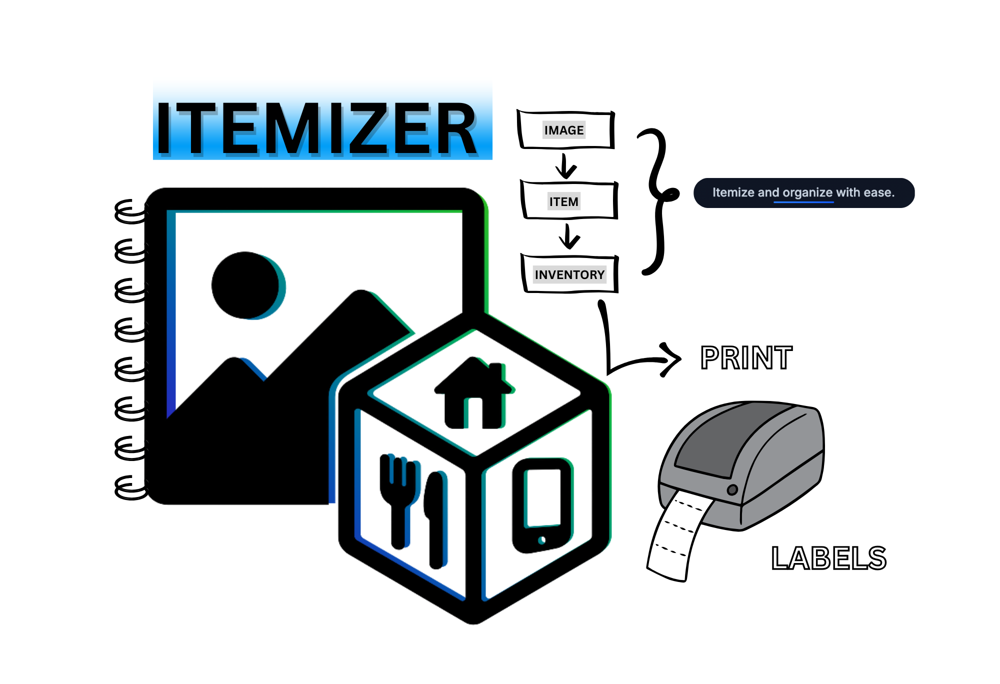

# The Itemizer
## AI-Powered Household Inventory Management



*A modern web application for cataloging and managing household items using computer vision and AI*

[](https://vercel.com/new/clone?repository-url=https://github.com/joshogden360/v0-home-ics-v14)
[](https://nextjs.org)
[](https://typescriptlang.org/)

## Overview

This is a full-stack inventory management system I built to solve the problem of tracking household items for insurance, moving, and organization. Instead of manually cataloging everything, you can take photos and let AI identify and crop individual items automatically.

**Live Demo**: [inventory-dashboard.vercel.app](https://v0-apartment-inventory-schema-git-main-joshogden360s-projects.vercel.app/)

## Features

### 🤖 AI-Powered Item Detection
- Upload photos and automatically detect individual items
- Google Gemini 2.5 Pro vision model for accurate identification
- Bounding box visualization with interactive selection
- Support for 40+ items per image with pixel-level accuracy

### 📸 Smart Image Processing
- Drag & drop or camera capture
- Real-time bounding box overlay
- Adaptive UI for dense item layouts
- Automatic image preprocessing and optimization

### 🏠 Complete Inventory Management
- Room-based organization
- Categories, tags, and conditions
- Maintenance tracking and scheduling
- Document attachments (warranties, receipts, manuals)

### 🔧 Enhanced Object Detection (In Development)
- New YOLO + SAM pipeline for pixel-perfect cropping
- Support for 100+ items per image
- Instance segmentation for precise item boundaries
- Python microservice with FastAPI

## Technology Stack

- **Frontend**: Next.js 15, React 19, TypeScript
- **Styling**: Tailwind CSS, shadcn/ui components
- **State**: Jotai atomic state management
- **Database**: PostgreSQL (Neon)
- **Storage**: Vercel Blob
- **AI**: Google Gemini 2.5 Pro
- **Auth**: Auth0

## Quick Start

1. **Clone and install**
   ```bash
   git clone https://github.com/joshogden360/v0-home-ics-v14.git
   cd v0-home-ics-v14
   npm install
   ```

2. **Environment setup**
   ```bash
   cp .env.example .env.local
   ```
   Add your API keys:
   ```env
   GOOGLE_AI_API_KEY=your_gemini_api_key
   DATABASE_URL=your_neon_postgres_url
   AUTH0_SECRET=your_auth0_secret
   AUTH0_BASE_URL=http://localhost:3000
   AUTH0_ISSUER_BASE_URL=your_auth0_domain
   AUTH0_CLIENT_ID=your_auth0_client_id
   AUTH0_CLIENT_SECRET=your_auth0_client_secret
   ```

3. **Run development server**
   ```bash
   npm run dev
   ```

4. **Open http://localhost:3000**

## How It Works

1. **Upload Image**: Drag & drop or capture photos of your items
2. **AI Analysis**: Gemini AI automatically detects and labels individual items
3. **Review & Select**: Interactive bounding boxes let you select which items to add
4. **Organize**: Assign rooms, categories, and add details
5. **Manage**: Track maintenance, attach documents, search and filter

## Current Status

### ✅ Production Features
- Fully functional inventory management system
- AI-powered item detection and cataloging
- Room and category organization
- Maintenance tracking
- Document management
- Responsive UI with dark/light themes

### 🚧 In Development (Enhanced Detection Branch)
- YOLO + SAM computer vision pipeline
- Pixel-perfect item segmentation
- 100+ items per image support
- Python FastAPI microservice
- Advanced preprocessing and optimization

## Architecture

```
Frontend (Next.js)
├── AI Service (lib/services/ai-service.ts)
├── UI Components (components/)
├── State Management (Jotai atoms)
└── API Routes (app/api/)

Backend Services
├── Gemini AI API (current)
├── PostgreSQL Database (Neon)
├── Blob Storage (Vercel)
└── CV Microservice (in development)
```

## Development

The project uses modern development practices:
- TypeScript for type safety
- ESLint + Prettier for code quality
- Atomic state management with Jotai
- Component-driven development with shadcn/ui
- Server actions for database operations

### Branch Structure
- `main` - Production ready code
- `enhanced-object-detection` - Advanced CV pipeline development
- Feature branches for new functionality

## Documentation

- [Enhanced Detection Roadmap](docs/ENHANCED_DETECTION_ROADMAP.md)
- [Bounding Box Progress Report](docs/BOUNDING_BOX_PROGRESS_REPORT.md)
- [AI Integration Reference](docs/AI_INTEGRATION_REFERENCE.md)
- [Deployment Troubleshooting](docs/DEPLOYMENT_TROUBLESHOOTING.md)

## About

Built by [Josh Ogden](https://www.joshogden360.io/), an independent developer focused on practical AI applications. This project started as a solution to a personal problem and evolved into a comprehensive inventory management system.

**Other Projects**: [Ragatouille Recipe AI](https://v0-ragatoullie-project-ppik3jtcp-joshogden360s-projects.vercel.app/) - AI-powered recipe generation and meal planning

## Contributing

This is an open-source project. Feel free to:
- Report bugs or suggest features via GitHub Issues
- Submit pull requests for improvements
- Fork and customize for your own use

## License

MIT License - see [LICENSE](LICENSE) file for details.

---

**Connect**: [joshogden360.io](https://www.joshogden360.io/) | [GitHub](https://github.com/joshogden360)
